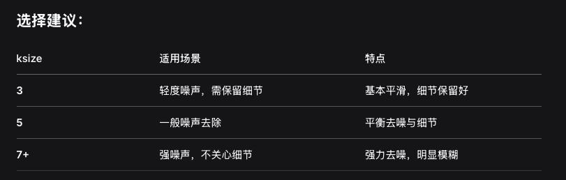
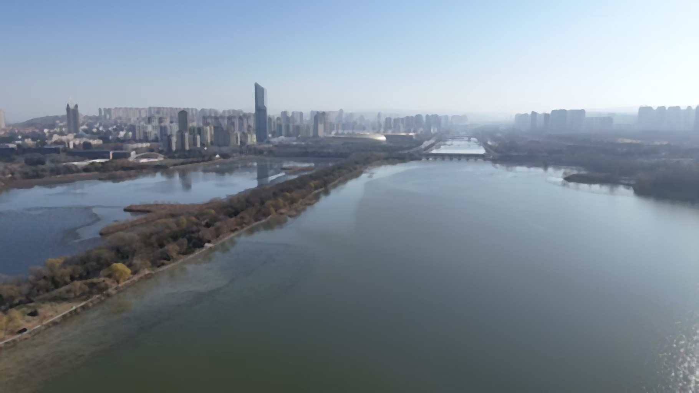

# 关于噪音控制ksize值的选取规则

## 中值滤波

下面是选取的所有的这三个k值不相同的的实际显示
- Origin Image

- k=3
 
- k=5

- k=7

我们可以发现我们使用无人机拍的左下角的天鹅,越来越模糊,
说明k值越大,模糊程度越高,那么k值越小,模糊程度越低
## 高斯滤波
- Origin Image

- k=3
 
- k=5

- k=7

## 均值滤波
- Origin Image

- k=3
 
- k=5

- k=7

我们发现只有高斯滤波给我们带来了最好的效果,就是k=7的时候,还可以看见我们左下角的大鹅.

