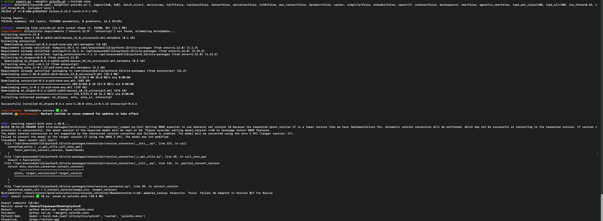

# 在cmake工程里面yolo的模型文件仅支持yolov5s.onnx格式的
那我们怎么把.pt 格式转换为 .onnx 格式呢？
## 1.克隆对应模型的源码，比如说我这里使用的是yolov5我就克隆
```bash
    git clone https://github.com/ultralytics/yolov5.git
```
## 2.安装需要的环境
```bash
    pip install torch
    pip install ultralytics
```
## 3.运行我们ultralytics给的官方输出
```bash
    python export.py --weights yolov5s.pt --include onnx
```
输出如下就证明安装好了，为了防止污染我们的工作区，我们只需要它的输出就可以了

Gemini 3 Recommand 
把这个文件的输出放在我们这个 yolo 目录下，运行发现这个不兼容
```bash
   python export.py --weights yolov5s.pt --include onnx --opset 12
```
发现这个也不可以运行
再次降低版本
```bash
   python export.py --weights yolov5s.pt --include onnx --opset 10
```
运行也是不成功<br>
而且官方提供的网站还出现了 404 错误</br>
Gemini 给我一个镜像的网站
<https://huggingface.co/amd/yolov5s/resolve/main/yolov5s.onnx>
这个是给 AMD 的 NPU 使用的
Gemini 又给了一个网址
<https://sourceforge.net/projects/yolov5-v6-1-onnx.mirror/files/yolov5s.onnx/download>
他又给我们一个 python 脚本，来让我们生成合适的
## 4.解决方案
https://github.com/ultralytics/yolov5/releases
在这个网页上找到下载的地方


